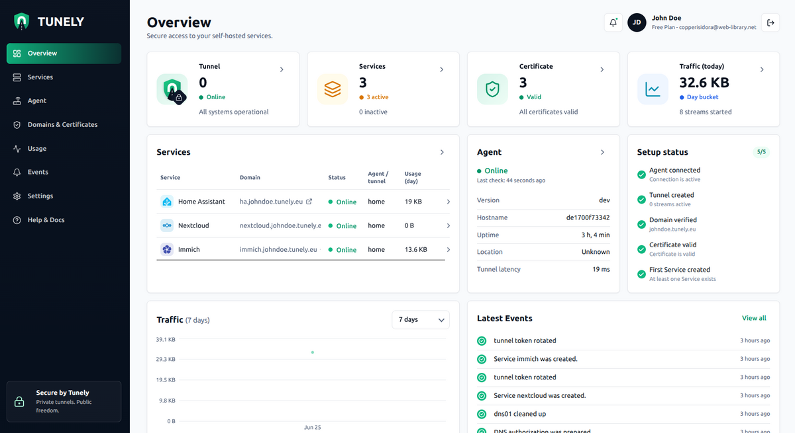

# Tunely Agent Add-on Documentation

Tunely Agent connects your Home Assistant system to Tunely so you can publish
selected local services through secure HTTPS addresses without opening router
ports.

The add-on is the local part of the setup. It runs inside Home Assistant,
connects outbound to Tunely, and applies the services you configure in the
Tunely dashboard.

## What Tunely Does

Tunely is useful when a local service should be reachable from outside your home
or small office network, but you do not want to:

- open router ports
- set up DynDNS
- maintain your own reverse proxy
- explain VPN clients to family, customers, or teammates
- expose an entire private network just to reach one service

Typical services include Home Assistant, Nextcloud, Jellyfin, Immich,
Paperless-ngx, dashboards, admin tools, and webhook endpoints.

Tunely publishes individual services. You choose what becomes reachable.



The Tunely dashboard shows whether the agent is online, which services are
published, which HTTPS addresses are active, and whether certificates and
traffic look healthy.

## Before You Start

You need:

- Home Assistant OS or another Supervisor-based Home Assistant installation
- a Tunely account
- a Tunely Agent token from the Tunely dashboard
- at least one local service that the add-on can reach

Home Assistant Container does not support Home Assistant add-ons. If you run
Home Assistant Container, install Tunely Agent outside Home Assistant instead.

## Configuration

### `token`

Required.

The Tunely Agent token connects this add-on instance to your Tunely account. Copy
the token from the Tunely dashboard and paste it into the add-on configuration.

Keep the token private. Anyone with the token can connect an agent instance to
the Tunely configuration assigned to it.

If you believe the token was exposed, remove or rotate it in the Tunely
dashboard and update the add-on configuration.

## First Setup

1. Install **Tunely Agent** from this Home Assistant add-on repository.
2. Open the **Configuration** tab.
3. Paste your Tunely Agent token into `token`.
4. Save the configuration.
5. Start the add-on.
6. Open the **Log** tab and wait until the agent reports that it is connected.
7. Open the Tunely dashboard.
8. Add a service and enter the internal address that the add-on should reach.
9. Use the HTTPS address shown by Tunely to access the service from outside your
   network.

## Choosing a Service Address

Each service needs an internal URL. This is the address the add-on uses from
inside your Home Assistant environment.

For Home Assistant itself, use:

```text
http://homeassistant:8123
```

For services on other devices, use a normal LAN address or hostname:

```text
http://192.168.1.50:8096
http://nas.local:5000
https://nextcloud.local
```

Use the same scheme and port that you would use from another device in your
local network.

## Avoid `localhost`

Do not use these addresses for services running on the Home Assistant host:

```text
http://localhost:8123
http://127.0.0.1:8123
```

Inside the add-on, `localhost` and `127.0.0.1` point to the add-on container
itself. They do not point to Home Assistant Core or to another add-on.

Use `http://homeassistant:8123`, a LAN IP address, a LAN hostname, or another
address that is reachable from the add-on.

## Network Behavior

The add-on does not require inbound connections from the internet. It opens an
outbound connection to Tunely and keeps that connection available for the
services you publish.

This is why Tunely can be useful behind:

- CGNAT
- DS-Lite
- mobile or shared networks
- routers you cannot or do not want to reconfigure
- networks where inbound port forwarding is not available

The add-on publishes only the services you configure in the Tunely dashboard. It
does not expose your whole LAN.

### Optional LAN and Split-DNS Access

The Agent also runs a local HTTPS listener inside the add-on container on port
`9443`. Home Assistant does not publish this listener on the host unless you set
an add-on network port mapping.

To use LAN or split-DNS access, open the add-on **Network** settings and map the
`9443/tcp` container port to host port `443`.

If the network port is disabled, the add-on continues to work through the normal
outbound Tunely connection only.

## Security Notes

Only publish services that are intended to be reachable through your Tunely HTTPS
addresses.

Tunely is built around end-to-end encrypted service access. Your services stay
on your own infrastructure, and certificate material is kept in the add-on data
volume. Tunely does not become the place where your application files, passwords,
or databases live.

Tunely is built on open source networking components:

- [Bifrost](https://github.com/tunely-eu/bifrost), the tunnel runtime
- [caddy-bifrost](https://github.com/tunely-eu/caddy-bifrost), the Caddy-native
  integration for Bifrost

You do not need to install or configure these projects separately for this
add-on.

## Backups and State

The add-on stores runtime state and certificate material under:

```text
/data/tunely-agent
```

This path is inside the normal Home Assistant add-on data volume. Home Assistant
hot backups include this data.

If you restore a backup onto another Home Assistant system, check the add-on log
after startup and confirm in the Tunely dashboard that the expected agent is
online.

## Logs

Use the add-on **Log** tab to inspect:

- startup status
- token or configuration errors
- connection status between the agent and Tunely
- service update activity

The log is the best first place to look when the add-on does not connect or a
published service is not reachable.

## Troubleshooting

### The add-on does not connect

Check:

- the add-on is started
- the token is present and copied correctly
- your Home Assistant host has outbound internet access
- the Tunely dashboard still shows the token or agent as valid

After changing the token, save the configuration and restart the add-on.

### Home Assistant is not reachable through Tunely

Use this internal service address:

```text
http://homeassistant:8123
```

Do not use `localhost` or `127.0.0.1`.

### Another local service is not reachable

Check:

- the service is running
- the address and port are correct
- the service can be reached from the Home Assistant network
- the service is not bound only to `127.0.0.1` on another machine
- the URL uses the right scheme, for example `http://` or `https://`

If the service is on another device, prefer its LAN IP address first. Once that
works, you can switch to a LAN hostname such as `nas.local`.

### The public HTTPS address stopped working

Check:

- the Tunely Agent add-on is still running
- the add-on log shows an active connection
- the local service is still running
- the internal service address has not changed
- the Tunely dashboard shows the service as enabled

If the agent is offline, the public HTTPS address cannot reach the local service
until the add-on reconnects.

## Support

For problems with this Home Assistant add-on, open an issue in this repository:

```text
https://github.com/tunely-eu/home-assistant-addons/issues
```

Do not publish suspected security vulnerabilities in public issues. Follow the
security policy in the repository instead.
