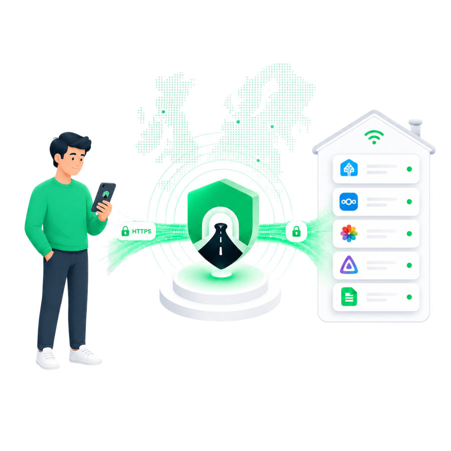

# Tunely Agent

[](https://github.com/tunely-eu/home-assistant-addons/releases/latest)
[](https://github.com/tunely-eu/home-assistant-addons/actions/workflows/ci.yml)
[](https://github.com/tunely-eu/home-assistant-addons/actions/workflows/release.yml)
[](config.yaml)



Tunely Agent gives Home Assistant and other self-hosted services secure HTTPS
addresses without opening router ports.

Install the add-on, paste your Tunely Agent token, and choose in the Tunely
dashboard which local services you want to publish. The agent connects outbound
to Tunely, so it also works in many networks where inbound access is difficult
or impossible, including CGNAT and DS-Lite setups.

## What You Can Publish

Use Tunely for services that already run in your home or small office network,
for example:

- Home Assistant
- Nextcloud
- Jellyfin or other media servers
- Immich, Paperless-ngx, dashboards, admin tools, and webhooks
- other local HTTP or HTTPS services

Tunely publishes individual services, not your whole private network. You stay
in control of what becomes reachable from the outside.

## Before You Start

You need:

- Home Assistant OS or another Supervisor-based Home Assistant installation
- a Tunely account
- a Tunely Agent token from the Tunely dashboard

Home Assistant Container does not support add-ons. Use the regular Tunely Agent
installation outside Home Assistant for that setup.

## Basic Setup

1. Install **Tunely Agent** from this add-on repository.
2. Paste your Tunely Agent token into the add-on configuration.
3. Start the add-on.
4. Open the add-on log and confirm that the agent connects to Tunely.
5. In the Tunely dashboard, publish the services you want to reach from outside
   your network.

## Service Addresses

Each published service needs an internal address that this add-on can reach.

Common examples:

```text
http://homeassistant:8123
http://192.168.1.50:8096
http://nas.local:5000
```

Use `http://homeassistant:8123` for Home Assistant itself. For services on other
devices, use their LAN address or hostname.

Do not use `localhost` or `127.0.0.1` for services running on the Home Assistant
host. Inside the add-on, those addresses point to the add-on container itself.

## Security Model

The agent opens an outbound connection to Tunely. Your router does not need
inbound port forwarding rules for the services you publish.

Tunely is built around end-to-end encrypted service access. Your services stay
on your infrastructure, and certificate material is kept in the Home Assistant
add-on data volume.

Tunely is built on open source networking components:

- [Bifrost](https://github.com/tunely-eu/bifrost)
- [caddy-bifrost](https://github.com/tunely-eu/caddy-bifrost)

You do not need to install these projects separately to use this add-on.

## Support

If the add-on does not connect or a service is not reachable, open the add-on
**Log** tab first. It shows startup, token, and connection status.

Issues for this add-on are tracked here:

```text
https://github.com/tunely-eu/home-assistant-addons/issues
```
